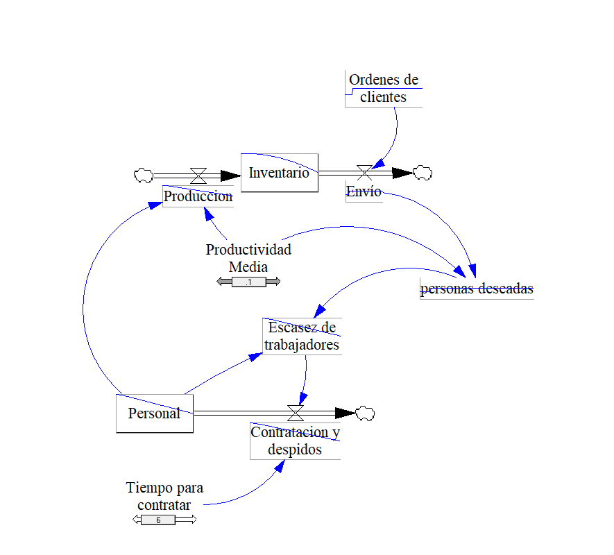
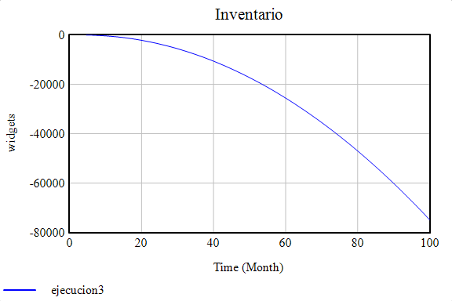
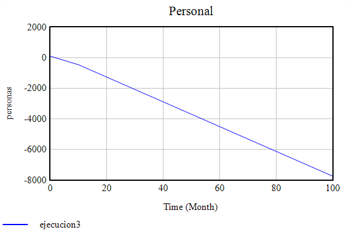

# Proyecto Arquetipo

Modelo de límites de éxito y crecimiento y subinversión en Vensim

## 🎯 Objetivo
La finalidad de este proyecto es mostrar la aplicación de los arquetipos de límites del éxito y desarrollo y crecimiento y subinversión.

## 🔨 Instalación
Para poder correr este modelo, es necesario tener instalado vensim, nosotros usamos la versión PLE.	

## 👀 Uso
Dentro del repositorio encontrarás el modelo en vensim para que puedas probarlo en tu vensim, así mismo de una explicación de los modelos que te ayuden a replicar y emplear el modelo. 

## 📷 Capturas de pantalla

### Escasez de trabajadores

### Contratación y despidos

### Inventario

### Personal

## 😊 Autores
Este trabajo fue desarrollado por [Fernando Cutire](https://github.com/FernandoCutire) y [Hellynger St. Rose](https://github.com/Hellynger), para el curso de sistemas dinámicos dictado por el profesor Modaldo Tuñónusando vensim PLE.

